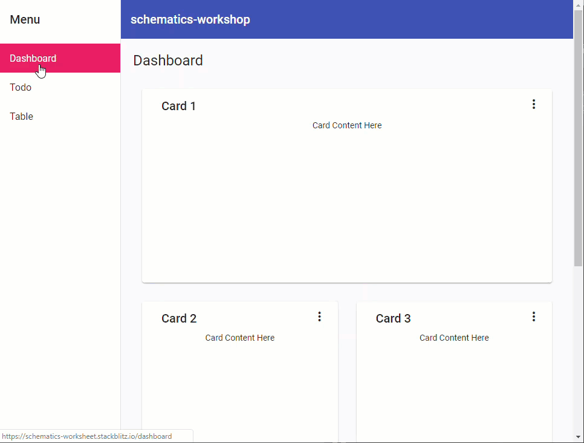

  

# Overview

Tonight we are using [schematics](https://angular.io/guide/schematics) from Angular Material and **CDK** (**C**omponent **D**evelopment **K**it) libraries to create an application. Schematics are templates to quickly scaffold code using the Angular CLI. Angular has some schematics built in. We'll show how easy schematics are to use and how to quickly scaffold a basic website. This is a self-directed workshop. We may interrupt work to check progress, if we find any mistakes or encounter new problems, special hints, etc. Please feel free to ask us or your neighbors for assistance.

At the end of this mini-workshop we'll have an application that looks like this. You can check it out for yourself [on StackBlitz](https://schematics-worksheet.stackblitz.io).



## Pre-requisites
For tonight's work, please install the latest version of Angular CLI. You will need a recent version of Node and npm. Install or update Angular CLI by running 

```sh
npm i -g @angular/cli
```

You'll also need an IDE of your choosing.


#### Hint- collapse the table of contents for worksheet

Click on the hamburger menu (<i class="fa fa-bars" aria-hidden="true"></i>) at the top of the page to toggle the table of contents. You can also use the keyboard shortcut `s`.



#### Hint- customize font size and color of the worksheet

Click on the font menu (<i class="fa fa-font" aria-hidden="true"></i>) at the top of the page to open a menu where you can make your font larger or smaller or change background color.

